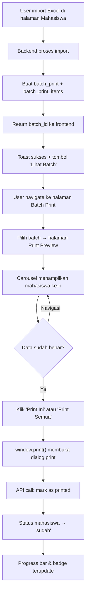

# Fitur Batch Print Ijazah

Membuat fitur batch printing untuk ijazah mahasiswa, yang memungkinkan pembuatan batch per-import, preview carousel data mahasiswa pada template, dan update status otomatis setelah print.

## User Review Required

> [!IMPORTANT]
> **Mekanisme Batch**: Setiap kali dilakukan import mahasiswa via Excel, sistem otomatis membuat 1 batch baru yang berisi seluruh mahasiswa dari import tersebut. Batch ini bisa langsung di-print sekaligus.

> [!IMPORTANT]
> **Template Matching**: Sistem akan mencocokkan template ijazah yang **aktif** (`is_active = 'aktif'`) berdasarkan `prodi_id` mahasiswa. Jika tidak ditemukan template aktif untuk prodi tersebut, fallback ke template global aktif (prodi_id = null). User perlu memastikan setiap prodi sudah memiliki template dengan status aktif.

> [!WARNING]
> **Posisi Field**: Data field mahasiswa akan ditempatkan menggunakan posisi dari tabel `posisi_template` (kolom `posisi_x`, `posisi_y`, `font_size`, `font_family`, `font_weight`, `text_color`, `alignment`). Jika tidak ada data di `posisi_template`, akan fallback ke `fields_positions` JSON yang tersimpan di `template_ijazah`.

---

## Proposed Changes

### 1. Database (Back-end)

#### [NEW] Migration: `create_batch_print_table`
**Path**: `back-end/staff.app/database/migrations/ijazah/2026_04_21_000000_create_batch_print_table.php`

Tabel `batch_print`:
| Kolom | Tipe | Keterangan |
|-------|------|------------|
| `id` | bigint (PK) | Auto-increment |
| `nama_batch` | string(100) | Nama batch (auto-generated: "Batch Import - {timestamp}") |
| `template_id` | unsignedBigInteger (nullable, FK → template_ijazah) | Template yang digunakan saat print |
| `total_mahasiswa` | integer | Jumlah mahasiswa dalam batch |
| `total_printed` | integer (default: 0) | Jumlah yang sudah terprint |
| `status` | enum ['pending', 'printing', 'completed'] | Status batch |
| `user_id` | unsignedBigInteger (nullable) | User yang membuat batch |
| `timestamps` | | created_at, updated_at |

---

#### [NEW] Migration: `create_batch_print_items_table`
**Path**: `back-end/staff.app/database/migrations/ijazah/2026_04_21_000001_create_batch_print_items_table.php`

Tabel `batch_print_items` (pivot antara batch dan mahasiswa):
| Kolom | Tipe | Keterangan |
|-------|------|------------|
| `id` | bigint (PK) | Auto-increment |
| `batch_id` | unsignedBigInteger (FK → batch_print, cascade) | Batch tempat item berada |
| `mahasiswa_id` | unsignedBigInteger (FK → mahasiswa, cascade) | Mahasiswa yang termasuk batch |
| `is_printed` | boolean (default: false) | Apakah item sudah dicetak |
| `printed_at` | timestamp (nullable) | Waktu dicetak |
| `timestamps` | | created_at, updated_at |

---

### 2. Models (Back-end)

#### [NEW] `BatchPrint.php`
**Path**: `back-end/staff.app/app/Models/BatchPrint.php`

- Relasi `hasMany` ke `BatchPrintItem`
- Relasi `belongsTo` ke `TemplateIjazah`
- Relasi `belongsTo` ke `User`

#### [NEW] `BatchPrintItem.php`
**Path**: `back-end/staff.app/app/Models/BatchPrintItem.php`

- Relasi `belongsTo` ke `BatchPrint`
- Relasi `belongsTo` ke `Mahasiswa`

#### [MODIFY] [Mahasiswa.php](file:///c:/laragon/www/staff/back-end/staff.app/app/Models/Mahasiswa.php)
- Tambah relasi `hasMany` ke `BatchPrintItem`

---

### 3. Controller (Back-end)

#### [NEW] `BatchPrintController.php`
**Path**: `back-end/staff.app/app/Http/Controllers/Api/BatchPrintController.php`

Endpoints:

| Method | Route | Fungsi |
|--------|-------|--------|
| `GET` | `/batch-print` | List semua batch (paginated, sortable, searchable) |
| `GET` | `/batch-print/{id}` | Detail batch + items + mahasiswa data + template + posisi |
| `POST` | `/batch-print` | Buat batch baru (manual select mahasiswa) |
| `POST` | `/batch-print/{id}/print` | Tandai batch/item sebagai sudah terprint → update status mahasiswa |
| `DELETE` | `/batch-print/{id}` | Hapus batch |

**Detail `GET /batch-print/{id}`**:
- Load batch beserta items, mahasiswa, prodi
- Load template ijazah yang terkait (by `template_id` atau match by prodi) — **hanya template dengan `is_active = 'aktif'`**
- Load `posisi_template` (dari tabel `posisi_template` berdasarkan `template_id`) untuk mapping posisi field
- Jika posisi_template kosong, fallback ke `fields_positions` JSON dari template_ijazah
- Return data lengkap untuk render carousel di frontend

**Detail `POST /batch-print/{id}/print`**:
- Menerima array `mahasiswa_ids` (opsional, kalau kosong = print semua)
- Update `batch_print_items.is_printed = true`, `printed_at = now()`
- Update `mahasiswa.status = 'sudah'` untuk setiap mahasiswa yang terprint
- Update `batch_print.total_printed` counter
- Jika semua sudah terprint, ubah `batch_print.status = 'completed'`

#### [MODIFY] [MahasiswaController.php](file:///c:/laragon/www/staff/back-end/staff.app/app/Http/Controllers/Api/MahasiswaController.php)
- Modifikasi method `import()`: Setelah import berhasil, otomatis buat record `batch_print` + `batch_print_items` untuk semua mahasiswa yang berhasil diimport
- Saat membuat batch, auto-assign `template_id` dari template ijazah **aktif** yang cocok dengan prodi mahasiswa
- Return `batch_id` dalam response import agar frontend bisa langsung navigate ke halaman batch print

#### [MODIFY] [MahasiswaImport.php](file:///c:/laragon/www/staff/back-end/staff.app/app/Imports/MahasiswaImport.php)
- Simpan array `imported_ids` berisi ID mahasiswa yang berhasil diimport
- Tambah getter `getImportedIds()` untuk diambil oleh controller

---

### 4. Routes (Back-end)

#### [MODIFY] [api.php](file:///c:/laragon/www/staff/back-end/staff.app/routes/api.php)
Tambahkan routes batch print:
```php
// Batch Print Routes
Route::get('/batch-print', [BatchPrintController::class, 'index'])->middleware('auth:sanctum');
Route::get('/batch-print/{id}', [BatchPrintController::class, 'show'])->middleware('auth:sanctum');
Route::post('/batch-print', [BatchPrintController::class, 'store'])->middleware('auth:sanctum');
Route::post('/batch-print/{id}/print', [BatchPrintController::class, 'markPrinted'])->middleware('auth:sanctum');
Route::delete('/batch-print/{id}', [BatchPrintController::class, 'destroy'])->middleware('auth:sanctum');
```

---

### 5. Frontend

#### [NEW] View: `batch-print/index.vue` — Daftar Batch
**Path**: `front-end/final/src/view/batch_print/index.vue`

- Tabel daftar semua batch (DataTable):
  - No, Nama Batch, Total Mahasiswa, Sudah Terprint, Status, Tanggal, Action
- Badge status: `pending` (warning), `printing` (info), `completed` (success)
- Action buttons: **Lihat & Print**, **Hapus**
- Progress bar menunjukkan persentase terprint

---

#### [NEW] View: `batch-print/print/index.vue` — Carousel Print Preview
**Path**: `front-end/final/src/view/batch_print/print/index.vue`

Halaman utama fitur — **Carousel Preview & Print**:

```
┌──────────────────────────────────────────────────────┐
│  Batch Print: "Batch Import - 2026-04-21 11:30"      │
│  Template: Template Ijazah S1 PAI                     │
│  Progress: ████████░░ 8/10 (80%)                      │
├──────────────────────────────────────────────────────┤
│                                                       │
│  ◀  [  PREVIEW IJAZAH MAHASISWA KE-3  ]  ▶           │
│                                                       │
│  ┌─────────────────────────────────────────────┐     │
│  │  ┌─────────────────────────────────────┐    │     │
│  │  │        [Background Template]         │    │     │
│  │  │                                      │    │     │
│  │  │  {{nomor_sk_ban_pt}} ← posisi_x/y   │    │     │
│  │  │  {{nama}} ← data mahasiswa           │    │     │
│  │  │  {{nim}} ← ditempel sesuai posisi    │    │     │
│  │  │  {{nik}}                              │    │     │
│  │  │  ...seluruh field sesuai template     │    │     │
│  │  │                                      │    │     │
│  │  └─────────────────────────────────────┘    │     │
│  └─────────────────────────────────────────────┘     │
│                                                       │
│  ┌ Mahasiswa: DAVID RIZKI ─────────────────────┐     │
│  │ NIM: 2014.85.01.1371  │  Status: ⚪ Belum   │     │
│  └──────────────────────────────────────────────┘     │
│                                                       │
│  [Print Ini]  [Print Semua Belum]  [Print Semua]      │
└──────────────────────────────────────────────────────┘
```

**Fitur Carousel**:
- Navigasi kiri/kanan antar mahasiswa dalam batch
- Indikator halaman (dot atau nomor)
- Keyboard shortcuts (← →) untuk navigasi
- Badge status per mahasiswa: sudah/belum terprint
- Filter: Tampilkan semua / Hanya belum terprint

**Rendering Template**:
- Canvas/div dengan background image dari `template_ijazah.file_background`
- Setiap field dari `posisi_template` ditempatkan sebagai `<span>` absolut
- Mapping field ke data mahasiswa:

| Field Key (posisi_template) | Sumber Data (mahasiswa) |
|---|---|
| `nomor_ijazah_nasional` | `mahasiswa.nomor_ijazah_nasional` |
| `nomor_sk_ban_pt` | `mahasiswa.nomor_sk_ban_pt` |
| `nilai_akreditasi` | `mahasiswa.nilai_akreditasi` |
| `nama_mahasiswa` | `mahasiswa.nama` |
| `tempat_tanggal_lahir` | `mahasiswa.tempat_lahir, tgl_lahir` (digabung) |
| `nim` | `mahasiswa.nim` |
| `nik` | `mahasiswa.nik` |
| `tanggal_kelulusan` | `mahasiswa.tanggal_sk_yudisium` |
| `program_studi` | `prodi.nama` |
| ... | ... |

**Print Workflow**:
1. User klik "Print Ini" → Panggil `window.print()` hanya untuk canvas aktif
2. Setelah dialog print ditutup → API call `POST /batch-print/{id}/print` dengan `mahasiswa_ids`
3. Frontend update status mahasiswa menjadi "sudah" di UI
4. Badge berubah dari kuning ke hijau
5. Progress bar terupdate

---

#### [MODIFY] [mahasiswa/index.vue](file:///c:/laragon/www/staff/front-end/final/src/view/mahasiswa/index.vue)
- Setelah import sukses, tampilkan toast dengan link/tombol **"Lihat Batch"** yang navigate ke halaman batch print baru
- Sertakan `batch_id` dari response import

---

#### [MODIFY] [router/index.ts](file:///c:/laragon/www/staff/front-end/final/src/router/index.ts)
Tambah routes:
```typescript
{
  path: 'batch-print',
  name: 'batch-print',
  component: () => import('../view/batch_print/index.vue'),
},
{
  path: 'batch-print/print/:id',
  name: 'batch-print-print',
  component: () => import('../view/batch_print/print/index.vue'),
},
```

---

## Alur Kerja User (End-to-end)



---

## Open Questions

> [!IMPORTANT]
> **Pilihan Template**: Saat membuat batch, apakah user harus memilih template secara manual, atau sistem auto-match berdasarkan prodi mahasiswa? Rencana saat ini: auto-match by prodi (hanya template aktif), dengan opsi manual override.

> [!IMPORTANT]
> **Print Method**: Apakah menggunakan `window.print()` native browser sudah cukup, atau perlu generate PDF di server (via DOMPDF/TCPDF)? `window.print()` lebih sederhana dan langsung, tapi kualitas tergantung browser. Server-side PDF lebih konsisten hasilnya.

> [!IMPORTANT]
> **Multi-Prodi dalam 1 Batch**: Jika dalam 1 file Excel ada beberapa sheet prodi (PAI, PBA, MPI, dst), apakah semua masuk 1 batch dengan template berbeda per-mahasiswa, atau dipecah menjadi beberapa batch per-prodi?

---

## Verification Plan

### Automated Tests
1. Jalankan migration: `php artisan migrate`
2. Test import → pastikan batch otomatis terbuat
3. Test API endpoint batch-print CRUD
4. Test print marking → pastikan status mahasiswa berubah

### Manual Verification
1. Import file Excel → cek batch terbuat dengan jumlah mahasiswa sesuai
2. Buka halaman Batch Print → cek tabel tampil benar
3. Masuk Print Preview → cek carousel menampilkan data mahasiswa pada posisi yang benar di template
4. Klik Print → cek status berubah dan progress terupdate
5. Kembali ke halaman Mahasiswa → pastikan kolom Status berubah menjadi "Sudah"
